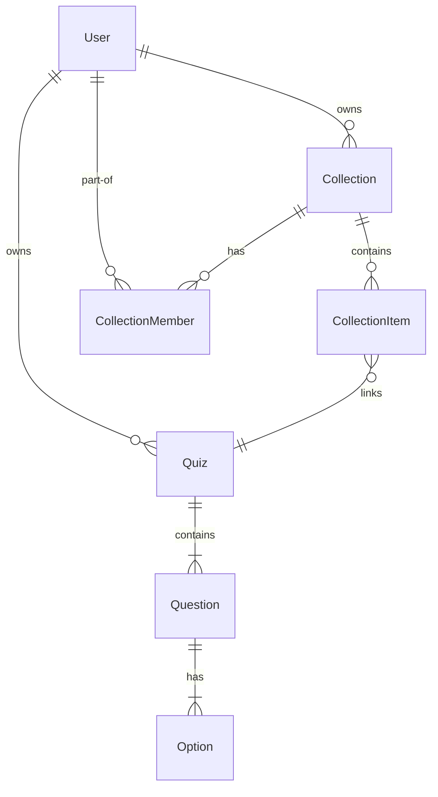

# Database Schema

## Overview

Kuizz uses a relational PostgreSQL database managed through Prisma ORM. The schema is designed to handle complex relationships between users, quizzes, game sessions, and collaborative workspaces.

## How It Works

### Core Models

-   **User**: Stores account information, credentials, and social login links.
-   **Quiz**: the primary content model, containing questions and linked to an owner.
-   **Question & Option**: Nested components of a quiz.
-   **GameSession**: Tracks the state and history of a live game, including a snapshot of the questions at the time the game started.
-   **Collection**: A group of quizzes with visibility and membership controls.

### Relationships

-   **One-to-Many**: `User -> Quiz`, `Quiz -> Question`, `Question -> Option`.
-   **Many-to-Many**: `Collection <-> Quiz` (via `CollectionItem`), `User <-> Collection` (via `CollectionMember`).

## Key Components

## Code References

-   **Prisma Schema**: `backend/prisma/schema.prisma`
-   **Migration History**: `backend/prisma/migrations/`

## Notes

The `GameSession` model includes a `questions` JSON field to store a snapshot of the quiz at the moment the game began, ensuring that even if the original quiz is edited later, the session records remain accurate.
